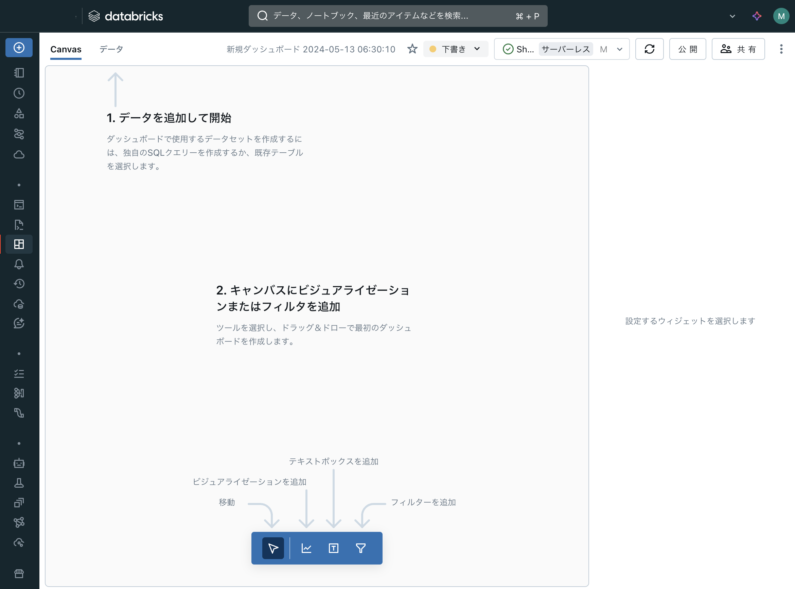
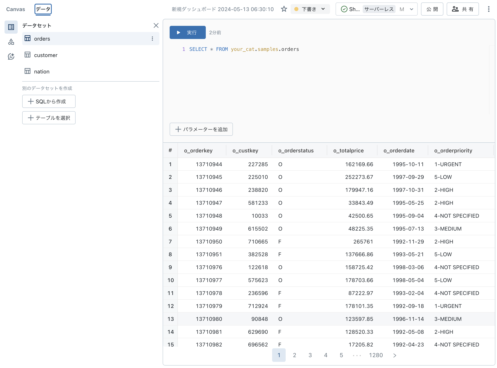
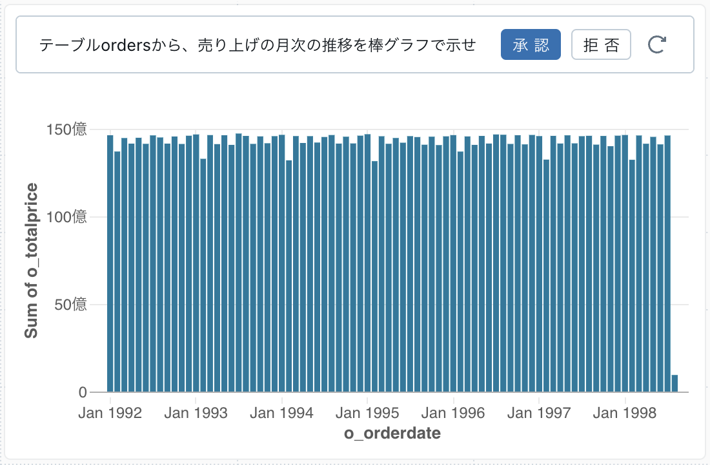
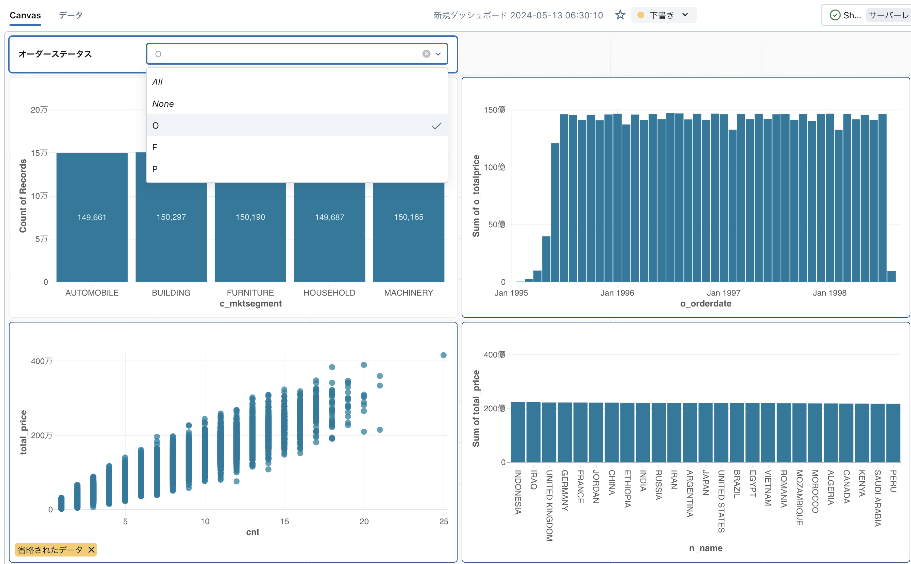

# Lakeviewによるデータ可視化とBIダッシュボード

## はじめに

Databricks上のデータを可視化(グラフ化)して、さらにそれらをダッシュボード化する機能であるLakeview(レイクビュー)について概要とクイックスタートガイドを見ていきます。Databricks


以下がダッシュボードのイメージです。今回の記事では、このダッシュボードの作り方と作成後の共有方法について見ていきたいと思います。


## 今までとこれから

以前からDatabricksを使っている場合、ダッシュボード機能というとOSSのRedashベースのものがプロダクトの中に組み込まれて提供されていました。その後、ダッシュボードのUI/UXの改善の目的で、UIを再構築したものがLakeviewです。そのため、グラフの種類・描画などはRedashから引き継ぎつつ、データの可視化手順やフィルタ作成をよりシンプルかつ柔軟に作成できるようになり、かつ、生成AIアシスタントによるプロンプトベースで可視化を実現する機能が追加されました。

そのため、この記事を執筆している時点(2024年5月現在)で、以前のRedashベースのダッシュボードを"レガシーダッシュボード"と呼んで、Lakeviewダッシュボードと区別しています。

ここでは簡単に両者の可視化の手順の違いについて見てみます。

#### レガシーダッシュボード:

概要: はじめにテーブルから可視化(グラフ・チャート)を作っておき、最後にダッシュードにまとめる

1. SQLベースでテーブルに対してクエリを実行し、結果のテーブルを得る。
2. 結果のテーブル(カラム)に対して、「可視化」を追加する。
3. 上記の1-2の手順をダッシュボード上に追加したい分だけ繰り返す
4. ダッシュボードに上記で作成した可視化(グラフ、チャート)を載せていき、1ページにまとめる


#### Lakeview

概要: ダッシュボード上で使うテーブルを選択し、ダッシュボードに配置しながら可視化を設定していく。

1. ダッシュボードで使用するテーブルを選択する(任意のSQLも可能)
2. ダッシュボード上で配置しながら、可視化の設定も入れていく


## LakeViewの機能

それでは、実際にダッシュボードを作成していく手順を見ていきます。

### サンプルデータの用意

今回のデモで使用するデータを用意します。Databricksではサンプルデータが使えるようになっているため、これらを使っていきます。ただし、Unity Catalog(Databricksのカタログ機能)上のテーブルがLakeviewの対象になるため、適当なカタログ(`your_cat`)を作成し、そこにサンプルデータをコピー(`CLONE`)しておきます。

以下のクエリをDatabricks上で実行します。SQLなので、Notebook上でもSQLクエリエディタ上でもどちらでも実行可能です。

```SQL
CREATE CATALOG your_cat;
CREATE SCHEMA your_cat.samples;

CREATE TABLE your_cat.samples.orders CLONE samples.tpch.orders;
CREATE TABLE your_cat.samples.customer CLONE samples.tpch.customer;
CREATE TABLE your_cat.samples.nation CLONE samples.tpch.nation;
```

上記の3つのテーブルデータは、
テーブル名から推測できる通り、ある小売店の売り上げデータ(POS)と顧客情報になります。


### ダッシュボードオプジェクトの作成

ワークスペースのディレクトリ上にダッシュボードのオブジェクト(ファイル)を新規作成します。
手順は以下のとおりです。

1. Databricksの左メニューから`ワークスペース`を選択
2. ダッシュボードオブジェクトを保存するディレクトリに移動(ここでは、ホームディレクトリ直下に配置します。)
3. 右上の`作成`ボタンから`ダッシュボード`を選択し、オブジェクトを作成
4. 以下のような新規ダッシュボード画面に遷移




売り上げの月次の推移を棒グラフで示せ


### データの追加

ダッシュボード上で可視化するデータ(テーブル)を追加していきます。
今回は、サンプルデータとして用意した以下の3つテーブルを使用します。

* `your_cat.samples.orders`
* `your_cat.samples.customer`
* `your_cat.samples.nation`

手順は以下の通りです。

1. ダッシュボードが開いた状態で、`データ`タブを開きます。
1. `テーブルを選択`ボタンをクリックし、上記のテーブルを選択します。
1. 3つのテーブルを追加した状態になります(下図)。




### チャートの配置

それではチャート(グラフ)をダッシュボードに追加していきます。
チャートの作り方は以下の２通りがあります。

1. マニュアルでX軸、Y軸などを設定する
1. AIアシスタントを利用して、プロンプト(自然言語、日本語)でチャートを設定する

まずは、マニュアルの方法で追加していきます。

1. `Canvas`タブに移動する
1. 画面下方にある`ビジュアライゼーションを追加`をクリックし、Boxを適当な位置に配置する。
1. 右側にある設定ペインで以下を追加(顧客データのマーケットセグメントの数を棒グラフで可視化する)
    - データセット: `customer`
    - 可視化: `棒グラフ`
    - X軸: `c_mktsegment`
    - Y軸: `COUNT(*)`
    - ラベル: `ON`
1. 以下のようなチャートが追加されます。
    - 


続いて、AIアシスタントを利用した方法で追加します。

1. (再度)画面下方にある`ビジュアライゼーションを追加`をクリックし、Boxを適当な位置に配置する。
1. 配置したBoxの上部にあるプロンプト窓に"`テーブルordersから、売り上げの月次の推移を棒グラフで示せ`"を記載し、`送信`をクリックする。
1. 描画されたチャートを確認して問題なければ`承認`をクリックする。
    - 

このように、プロンプトでどのデータをどのように可視化するかを指示するだけでダッシュボードにチャートを追加できます。特に、集約関係(上記の例では"月次毎に集計"としている部分)はプロンプトで実施すると非常に楽になります。

また、プロンプトで作成したチャートについても右側のペインからオプションを設定変更可能です。

## チャートの配置(応用)

ここまでは単一のテーブルについてのチャートを描いていきました。しかし、複数のテーブルから一つのチャートを作成する必要があるケースもあります。例えば、注文データから国別の売り上げ数をカウントしたい、購入回数に対する売り上げ合計の全体像を描画したい、などのケースが考えられます。

Lakeviewでは、可視化するテーブルを指定する際に、テーブルそのものではなく、SQL(の実行結果のテーブル)を指定することも可能になっています。ここでは、`orders`,`customer`,`nation`の3つのテーブルの結合をSQLで指定して、その結果をチャートにしていくパターンを見ていきます。

1. `データ`タブに移動して、`SQLから作成`ボタンをクリックし、以下のクエリを`実行`する。
    ```SQL
    -- オーダー状態と顧客IDで売り上げ集計した結果から、顧客情報と国情報を結合する
    with total_price_by_customer as (
      select
        o_custkey,
        o_orderstatus,
        count(*) as cnt,
        sum(o_totalprice) as total_price
      from
        your_cat.samples.orders
      group by
        o_custkey,
        o_orderstatus
    ),
    final as (
      select
        *
      from
        total_price_by_customer t
        join your_cat.samples.customer c on t.o_custkey = c.c_custkey
        join your_cat.samples.nation n on c.c_nationkey = n.n_nationkey
    )
    select
      *
    from
      final
    ```
1. 左側のテーブルのリストから、このクエリの名前を`joined_table`に変更する

これで、結合したデータの準備ができました。あとは可視化の方法はこれまでと同じです。
以下通り新たに2つのチャートを追加していきましょう。


1. (再度)`Canvas`タブに移動し、下方にある`ビジュアライゼーションを追加`をクリックし、Boxを適当な位置に配置する
1. **購入回数に対する売り上げ合計の全体像のチャート** を追加する
    1. データセット: `joined_table`
    1. 可視化: `散布図`
    1. X軸: `cnt`
    1. Y軸: `total_price`
1. (再度)下方にある`ビジュアライゼーションを追加`をクリックし、Boxを適当な位>置に配置する
1. **国別の売り上げチャート** を追加する
    1. プロンプト窓: `joined_tableテーブルから国別の売り上げを棒グラフで示せ`
    1. `承認`をクリック
1. 以下のようなチャートが描画されます。
    


### フィルタの追加

ダッシュボードの機能としてフィルタを追加して見ましょう。
ここでは、`order status`のフィルタ条件を追加してみます。

1. 画面下方にある`フィルタを追加`ボタンをクリックし、ダッシュボード上の適当な場所に配置する。
1. 右の設定ペインで以下を設定する
    - フィルタ: `単一値`, タイトル=>`ON`
    - フィールド: 
        + `orders > o_orderstatus`
        + `joined_table > o_orderstatus`
    - フィルター設定: 許可すべて => `ON`
1. フィルターBox内でタイトル部分をクリックし`オーダーステータス`に変更する

以上で、フィルタが追加できました。このフィルタ値を設定することで、条件付けされた結果が描画されます。




### ダッシュボードの共有・公開

チャートなどを配置して作成したダッシュボードの共有について見ていきます。
ダッシュボードは以下の2つのモード(状態)を持っています。

1. 下書きモード: ダッシュボードを編集するためのモード
1. 公開モード: 外部にダッシュボードとして公開するためのモード

一つのダッシュボードについて、2つのモード状態が**併存します**。つまり、下書きモードと公開モードで独立にダッシュボードが管理されます。
下書きモードでダッシュボードを編集・変更・作成した場合には、下書きモードとして保存されます。この状態から"公開"モードにすることで公開モードが上書きされます。下書きモードで編集しても、"公開"しない限り、公開されているダッシュボードには影響がありません。

この2つのモードの違いは、ダッシュボードの共有時にも関係してきます。すなわち、下書きモードも含めて共有を許可するのか、完成した(公開された)ダッシュボードのみを共有するのかで分かれます。

共有設定と共有される範囲は以下の通りです。

| 許可範囲 |  閲覧可能 | 実行可能 | 編集可能 | 管理可能 |
| ---      | --- | ---| --- | --- | 
| 公開ダッシュボードの表示 | O | O | O | O |
| ウィジェットの操作(フィルタ適用など) | O | O | O | O |
| ダッシュボードの複製 | O | O | O | O |
| 最新データでチャート状態をアップデート | | O | O | O | O |
| ダッシュボードを編集 |  |  | O | O |
| ダッシュボードを削除 |  |  |  | O |
| ダッシュボードの権限変更 |  |  |  | O |


これまで編集していたダッシュボードは **"下書き"モード** で行っていました。
ダッシュボードを公開モードにするには(下書きモードの状態を公開モードに上書きするには)、画面上部にある`公開`ボタンをクリックします。加えて、`共有`ボタンから共有するユーザーを適切な権限で追加します。
これにより、上記で作成したダッシュボードが公開・共有できます。


## まとめ

今回はDatabricksのダッシュボード機能であるLakeviewについて見てきました。AIアシスタントを利用することでSQLを書かなくてもデータの可視化ができ、「データの民主化」の一つのサービス形態を提供しています。今回は基本的な描画機能のみを使用しましたが、アナリティクスで必要になるチャートは一通り揃っていますので、是非手を動かして試してみてください。

### 参考

* 公式ドキュメント - [www.databricks.com/jp/databricks-documentation](https://www.databricks.com/jp/databricks-documentation)
* 本記事のコードは[https://github.com/ktmrmshk/lakehousebook/tree/main/Lakeview](https://github.com/ktmrmshk/lakehousebook/tree/main/Lakeview)で参照可能です。
