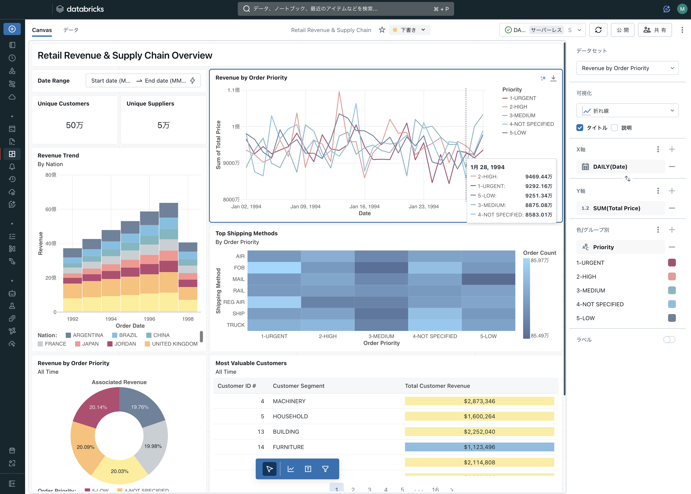

# Lakeviewによるデータ可視化とBIダッシュボード

## はじめに

Databricks上のデータを可視化(グラフ化)して、さらにそれらをダッシュボード化する機能であるLakeview(レイクビュー)について概要とクイックスタートガイドを見ていきます。Databricks

以下がダッシュボードのイメージです。今回の記事では、このダッシュボードの作り方と作成後の共有方法について見ていきたいと思います。

## 今までとこれから

以前からDatabricksを使っている場合、ダッシュボード機能というとOSSのRedashベースのものがプロダクトの中に組み込まれて提供されていました。その後、ダッシュボードのUI/UXの改善の目的で、UIを再構築したものがLakeviewです。そのため、グラフの種類・描画などはRedashから引き継ぎつつ、データの可視化手順やフィルタ作成をよりシンプルかつ柔軟に作成できるようになり、かつ、生成AIアシスタントによるプロンプトベースで可視化を実現する機能が追加されました。

そのため、この記事を執筆している時点(2024年5月現在)で、以前のRedashベースのダッシュボードを"レガシーダッシュボード"と呼んで、Lakeviewダッシュボードと区別しています。

ここでは簡単に両者の可視化の手順の違いについて見てみます。

#### レガシーダッシュボード:

概要: はじめにテーブルから可視化(グラフ・チャート)を作っておき、最後にダッシュードにまとめる

1. SQLベースでテーブルに対してクエリを実行し、結果のテーブルを得る。
2. 結果のテーブル(カラム)に対して、「可視化」を追加する。
3. 上記の1-2の手順をダッシュボード上に追加したい分だけ繰り返す
4. ダッシュボードに上記で作成した可視化(グラフ、チャート)を載せていき、1ページにまとめる

#### Lakeview

概要: ダッシュボード上で使うテーブルを選択し、ダッシュボードに配置しながら可視化を設定していく。

1. ダッシュボードで使用するテーブルを選択する(任意のSQLも可能)
2. ダッシュボード上で配置しながら、可視化の設定も入れていく

## LakeViewの機能

## Lakeviewで

## ダッシュボードの共有と公開

## ダッシュボードの定期配信

## ダッシュボードのインポート・エクスポート

