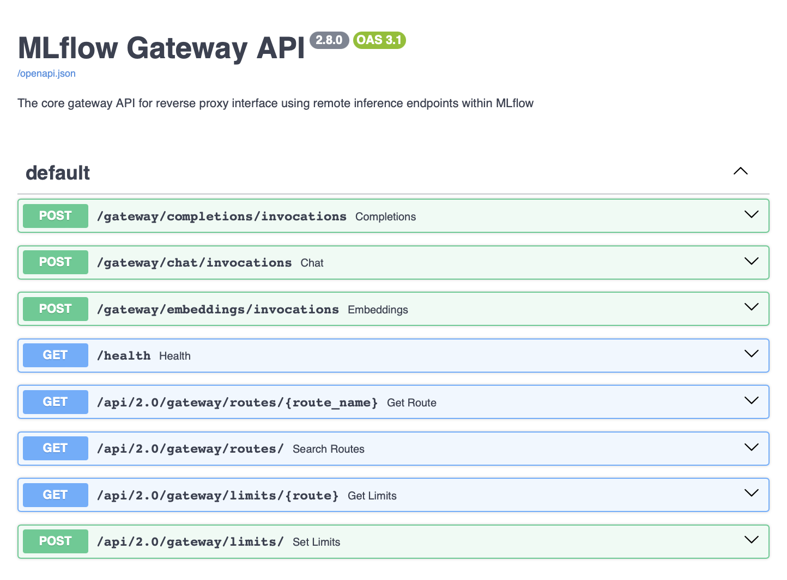
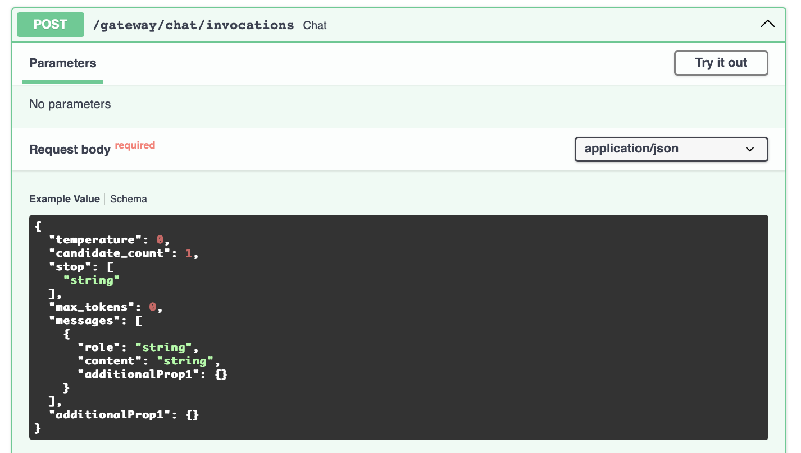
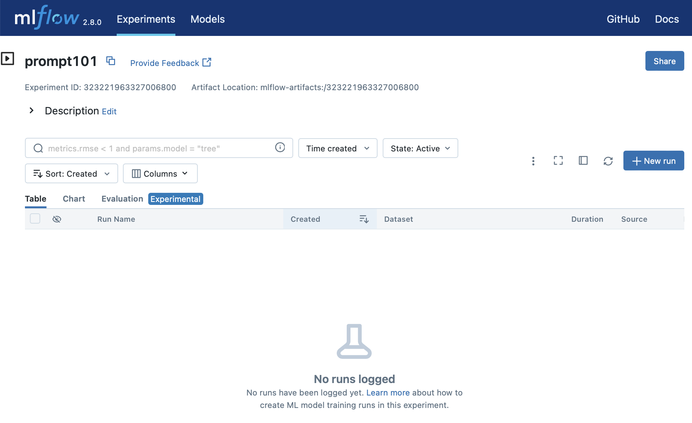
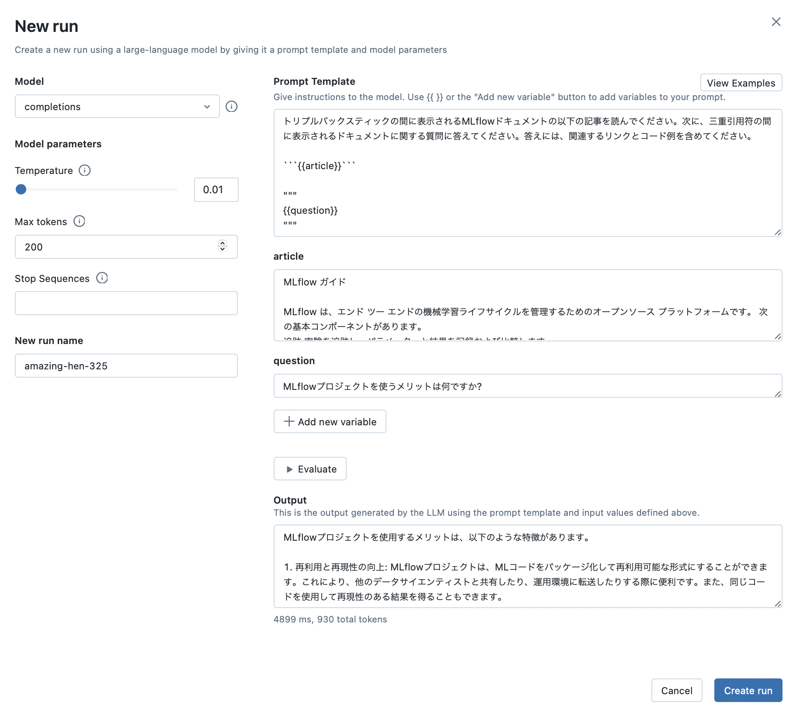
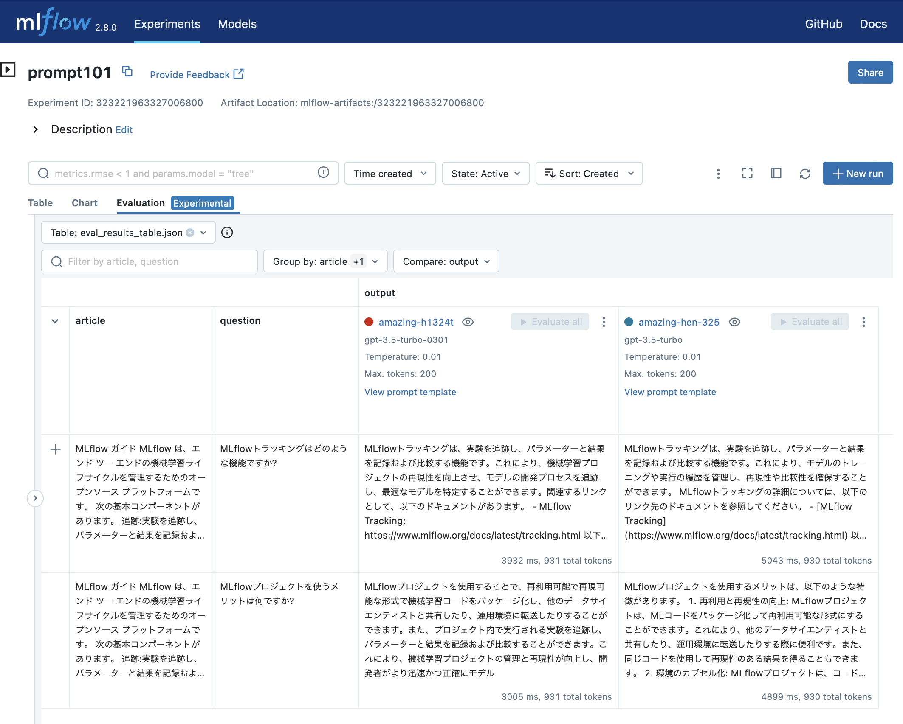

# 大規模言語モデルのためのMLflow

MLflow2.8では、昨今の大規模言語モデル(Large Language Model, LLM)の広まりを受けて、LLMの構築や運用に関わる機能が追加されました。LLMは、実体としてはDNNモデルである点では従来の機械学習の運用の延長線上にあります。一方で、実際には従来の機械学習とは異なる扱いをする点もいくつかあります。例えば、LLMはモデルサイズが非常に大きく、スクラッチからモデルを作成するよりも既存のモデルを使用する、もしくは、既存のモデルをベースに転移学習やファインチューニングを実施することが現状ではほとんどのケースになっています。

そのため、さまざまなLLMに関わるサービスやツールが開発・公開されており、これらを比較しながら最適なLLMシステムを構築する必要があります。また、モデルの評価方法についても、LLM自体の対象が自然言語であることから、数値的なメトリックに加えて、われわれ人間が確認する場面も多いです。プロンプトエンジニアリングにおいても、人間が入力し、出力を目でみて評価する作業の繰り返しになります。MLflow2.8では、LLMを扱う上で必要な作業を効率的に実施するヘルパー機能が追加されています。

## MLflow AI Gateway

MLflow AI Gatewayは、さまざまなLLMプロバイダやフレームワークとの連携のための統一したインタフェースを提供する機能です。執筆時点ではOpenAI、MosaicML、Cohere、Anthropic、PaLM 2、AWS Bedrock、AI21 Labsなどに対応しています。また、メジャーなSaaS LLMプロバイダーのサポートに加え、MLflowモデルサービングへの統合も実装されており、独自のLLMや微調整された基盤モデルを自社のサービングインフラストラクチャ内でサービングすることができます。

MLflow AI Gatewayを利用することで以下のメリットが享受できます。

1. 統一されたエンドポイントとAPI実装: LLMプロバイダごと独自APIを隠蔽します
1. シンプルな設計: 設定やセットアップが一度で完結
1. 安全なクレデンシャル管理: APIキーの一元管理とハードコーディングの回避
1. ゼロダウンタイムでのLLMプロバイダ切り替え: コード変更なしにLLMプロバイダやルートを変更

### Gatewayのセットアップ

ここではOpenAIをLLMプロバイダとして使用する例を見ていきましょう。最初にMLflow AI Gateway Serviceをインストールします。PyPIレポジトリもしくはMLflowリポジトリから`pip`コマンドでインストールできます。

```bash
pip install 'mlflow[gateway]'
```

続いてOpenAI API Keyを用意します。ここではOpenAIのみを使用する例を見ていきますが、複数のLLMプロバイダを混在させて使用することも可能です。その場合は、それぞれのAPI Keyなどのクレデンシャルが必要になります。環境変数を使用してAPI Keyを登録します。

```bash
export OPENAI_API_KEY='ここにあなたのAPI KEYを記載する'
```

続いてGateway設定ファイルを作成します。この設定ファイルの中にGatewayで受ける経路(Route)をYAML形式で記述します。それでは、補完(Completion)、会話(Chat)、埋め込み(Embeddings)の3経路を定義します。

```yaml
routes:
  - name: completions
    route_type: llm/v1/completions
    model:
      provider: openai
      name: gpt-3.5-turbo
      config:
        openai_api_key: $OPENAI_API_KEY

  - name: chat
    route_type: llm/v1/chat
    model:
      provider: openai
      name: gpt-3.5-turbo
      config:
        openai_api_key: $OPENAI_API_KEY

  - name: embeddings
    route_type: llm/v1/embeddings
    model:
      provider: openai
      name: text-embedding-ada-002
      config:
        openai_api_key: $OPENAI_API_KEY
```

この設定ファイル(`config.yaml`)を使用してGatewayサービスを起動します。

```bash
mlflow gateway start --config-path config.yml
```

起動時にオプションで、サービスのListenホスト・ポート番号やサービスのワーカー数などが変更できます。デフォルトではホストは`localhost`、ポート番号は`5000`、ワーカー数は`2`で起動します。

Gatewayサービス起動後は、エンドポイントとしての機能に加えて、APIドキュメントサービスも提供します。ブラウザを使用して`http://localhost:5000`にアクセスしてみましょう。図XXXにある通り、OpenAPI形式のリファレンスが確認できます。また、リファレンスの各API定義の詳細ペインの中にある`Try Out`メニューからAPIへのリクエストを送信することも可能です(図XXX)。






Gatewayサービスへは、上記のブラウザからのTry Out UIの他に、Fluent API、Client API、そしてRESTful APIでリクエストを送信することが可能です。それぞれ見ていきましょう。

### Fluent API

以下がFluent APIを使用する例です。

```python
from mlflow.gateway import query, set_gateway_uri

set_gateway_uri(gateway_uri="http://localhost:5000")

response = query(
    "chat",
    {"messages": [{"role": "user", "content": "1週間のうち一番良い曜日は何ですか?"}]},
)

print(response)
```

レスポンスは以下のような形式になります。

```
{
  "candidates": [
    {
      "message": {
        "role": "assistant",
        "content": "それは個人の好みや状況によって異なるかもしれません。一般的には、週末の土曜日や日曜日が人気があります。これらの日は多くの人が休みであり、リラックスしたり、趣味や家族との時間を楽しむことができます。ただし、仕事や学校のスケジュールによっては、他の曜日が一番良いと感じることもあります。"
      },
      "metadata": {
        "finish_reason": "stop"
      }
    }
  ],
  "metadata": {
    "input_tokens": 27,
    "output_tokens": 145,
    "total_tokens": 172,
    "model": "gpt-3.5-turbo-0613",
    "route_type": "llm/v1/chat"
  }
}
```

### Client API

Client APIを使用すると、Gatewayについての詳細な操作が可能です。例えば、Gatewayに登録され、利用可能な経路を参照することができます。

```python
from mlflow.gateway import MlflowGatewayClient

gateway_client = MlflowGatewayClient(gateway_uri="http://192.168.64.21:5000")

routes = gateway_client.search_routes()
for route in routes:
    print('----')
    print(route)
```

結果は以下の通りです。

```
----
name='completions' route_type='llm/v1/completions' model=RouteModelInfo(name='gpt-3.5-turbo', provider='openai') route_url='http://192.168.64.21:5000/gateway/completions/invocations'
----
name='chat' route_type='llm/v1/chat' model=RouteModelInfo(name='gpt-3.5-turbo', provider='openai') route_url='http://192.168.64.21:5000/gateway/chat/invocations'
----
name='embeddings' route_type='llm/v1/embeddings' model=RouteModelInfo(name='text-embedding-ada-002', provider='openai') route_url='http://192.168.64.21:5000/gateway/embeddings/invocations'
```

もちろん、Gatewayの経路に対してリクエストを出すこともできます。

```python
response = gateway_client.query(
    "chat", {"messages": [{"role": "user", "content": "1週間のうち一番良い曜日は何ですか?"}]}
)
print(response)
```

出力結果は前述のFluent APIの場合と同じです。


### LangChainとの連携

Client APIを使うメリットは、LangChainとの連携です。Gatewayの経路をLangChainの`llm`として使用することができます。
以下は、Gateway上の`completion`経路をLangChainの`llm`として使用するコード例です。

```python
import mlflow
from langchain import LLMChain, PromptTemplate
from langchain.llms import MlflowAIGateway

gateway = MlflowAIGateway(
    gateway_uri="http://127.0.0.1:5000",
    route="completions",
    params={
        "temperature": 0.0,
        "top_p": 0.1,
    },
)

llm_chain = LLMChain(
    llm=gateway,
    prompt=PromptTemplate(
        input_variables=["adjective"],
        template="{adjective} 冗談を言ってください",
    ),
)
result = llm_chain.run(adjective="面白い")
print(result)
```

出力は以下の通りです。

```
「なぜカエルは車に乗らないのか？　なぜなら、自分で運転するとハンドルが手に合わないからだよ！」
```

### REST API

GatewayはREST APIもサービス提供します。一般的なアプリケーション、既存のアプリケーションとの連携もスムーズになります。ここでは、`curl`クライアントを使ってREST APIでリクエストする例を見ていきます。リクエストのBodyのスキーマは、前述したOpenAPI形式のリファレンスから参照できます。最初に利用可能な経路をリストしてみましょう。

```
curl -X GET http://127.0.0.1:5000/api/2.0/gateway/routes/

[結果]
{
    "routes": [
        {
            "name": "completions",
            "route_type": "llm/v1/completions",
            "model": {
                "name": "gpt-3.5-turbo",
                "provider": "openai"
            },
            "route_url": "/gateway/completions/invocations"
        },
        {
            "name": "chat",
            "route_type": "llm/v1/chat",
            "model": {
                "name": "gpt-3.5-turbo",
                "provider": "openai"
            },
            "route_url": "/gateway/chat/invocations"
        },
        {
            "name": "embeddings",
            "route_type": "llm/v1/embeddings",
            "model": {
                "name": "text-embedding-ada-002",
                "provider": "openai"
            },
            "route_url": "/gateway/embeddings/invocations"
        }
    ],
    "next_page_token": null
}
```

Gatewayの特定の経路へのリクエストは`POST /gateway/{経路名}/invocations`になります。それでは、先ほどFluent APIで実行したものと同等のクエリをREST APIで実行してみましょう。なお、出力結果は先ほどと同じです。

```bash
curl -X POST http://localhost:5000/gateway/chat/invocations \
  -H "Content-Type: application/json" \
  -d '{"messages": [{"role": "user", "content": "1週間のうち一番良い曜日は何ですか?"}]}'
```

### 複数のLLMの比較

Gatewayの強力な側面は、経路を複数定義でき、それらを簡単に切り替えることができるという点です。経路の名前を複数用意してクライアント・アプリケーション側で切り替えることもできますし、Gatewayの設定ファイル(`config.yaml`)の中で同じ経路名でパラメータを変更することでクライアント・アプリケーション側のコードは変更せずにLLMを入れ替えることができます。

ここでは、前者の経路名を複数用意する方法を見ていきます。先ほど設定した`config.yaml`に以下の経路を追加します。

```yaml
routes:
  - name: completions
    route_type: llm/v1/completions
    model:
      provider: openai
      name: gpt-3.5-turbo
      config:
        openai_api_key: $OPENAI_API_KEY
        
  - name: completions-gpt4-turbo
    route_type: llm/v1/completions
    model:
      provider: openai
      name: gpt-4-1106-preview
      config:
        openai_api_key: $OPENAI_API_KEY
        
  - name: completions-instruct
    route_type: llm/v1/completions
    model:
      provider: openai
      name: gpt-3.5-turbo-instruct
      config:
        openai_api_key: $OPENAI_API_KEY
```

この設定ファイルの変更は、既存からある経路`completions`は保持したまま、新しい経路`completions-gpt4-turbo`と`completions-instruct`を追加します。設定ファイルを更新したら、変更を保存するだけです。ゲートウェイはダウンタイムなしで自動的に新しいルートを作成します。

### AI Gatewayのセキュリティ

これまで見てきた通りGatewayサービスは動作確認の簡単化のため通信経路上では暗号化しない`http`プロトコルを使用してきました。Gatewayサービスを本番環境で使用する際にはリバースプロキシを用意し、TLSを使用して通信経路上の暗号化を実施する`https`プロトコルを利用する必要があります。リバースプロキシとしてよく使われるのはNginxです。アプリケーションへのトラフィックを処理することに加えて、Nginxは静的なファイルのサーブもでき、アプリケーションの複数のインスタンスが動作している場合にトラフィックの負荷分散を行うこともできます。

リバースプロキシに加えて、リクエストが MLflow AI ゲートウェイに到達する前に認証レイヤーを追加することも推奨されます。HTTPベーシック認証、OAuth、などニーズにあった方式を検討してください。


## プロンプトエンジニアリングUI

MLflow AI Gatewayによって、さまざまなLLMプロバイダを切り替えが極めてシンプルになりました。一方で、LLMは機械学習モデルへの入力および出力が自然言語であるため、ユーザーや開発者がインタラクティブに操作する場面が頻繁に発生します。その度にコードを書いてAPI実行するとなると煩雑かつ時間がかかります。MLflowでは、この作業を効率的に実施するインタラクティブなインタフェースとしてプロンプトエンジニアリングUIを提供します。この機能の特徴は以下の通りです。

1. 反復の開発: 煩雑な操作を排除し、試行錯誤のための合理化された体験を提供
1. UIベースのプロトタイピング: プロトタイプの作成、繰り返し、プロンプトの改良を、コードを深掘りせずに実施可能
1. わかりやすいエンジニアリング: ユーザーフレンドリーなUIで実験スピードが加速
1. 最適化されたパラメータ設定: 質問応答や文書要約のようなタスクに最適なモデル構成を迅速に発見
1. 透明性を担保するトラッキング: 全てのトライが詳細に記録され、プロンプト開発の再現性や透明性を保証

プロンプトエンジニアリングUIの使用により、
コード不要で、AI ゲートウェイからの複数のLLM、パラメータ設定、およびプロンプトを試して、質問応答、ドキュメントの要約、およびそれ以上の様々なモデルを構築することができます。組み込みの評価UIを使用すると、一連の入力に対して複数のモデルを評価し、応答を比較して最適なものを選択することもできます。プロンプト・エンジニアリング UI で作成されたモデルはすべて MLflow Model 形式で保存され、バッチまたはリアルタイムの推論用にデプロイすることができます。すべての構成（プロンプトテンプレート、LLM の選択、パラメータなど）は、MLflow Runs として追跡されます。

### プロンプトエンジニアリングUIのセットアップ

プロンプトエンジニアリングUIはAI Gatewayのクライアントとして機能します。プロンプトエンジニアリングUIを使用するには、Gatewayとは別にmlflowサーバを起動させる必要があります。先ほど起動したGatewayは`localhost:5000`で起動していますので、ここではプロンプトエンジニアリングUIのためのmlflowサーバを`localhost:5001`で起動します。両者の連携は環境変数`MLFLOW_GATEWAY_URI`を介して設定します。

```bash
export MLFLOW_GATEWAY_URI="http://localhost:5000"
mlflow server --port 5001
```

mlflowサーバが起動できたらブラウザで`http://localhost:5000`にアクセスしてみます(図XXX)。既存のExperimentがなければ新規で作成します。ここでは例として`Prompt101`という名前のExperienceを作成し、使用します。



### プロンプトエンジニアリングのプロセス

次に **New Run** メニューから *using Prompt Engineering* を選択します。これにより、プロンプトエンジニアリングのSandobox画面が開き、LLM、パラメータ、そして、プロンプトを変更し実行できます(図XXX)。

以下のプロンプトのテンプレートを実行してみましょう。テンプレートの中に含まれる変数`{{article}}`および`{{question}}`は自動的にキャプチャされUI上に入力フォームが表示されます。

`````
トリプルバックスティックの間に表示されるMLflowドキュメントの以下の記事を読んでください。次に、三重引用符の間に表示されるドキュメントに関する質問に答えてください。答えには、関連するリンクとコード例を含めてください。

```{{article}}```

"""
{{question}}
"""
`````

このテンプレートに対して以下の変数を入力し、**Evaluate** ボタンをクリックします。Gatewayを経由してOpenAIプロバイダにリクエストが送信され、結果がUI上に表示されます(図XXX)。

* Model: completion
* Temperature: 0.01
* Max tokens: 200
* `article`の入力: `https://learn.microsoft.com/ja-jp/azure/databricks/mlflow/`のドキュメント内容
* `question`の入力: MLflowプロジェクトを使うメリットは何ですか?



結果を記録するには **Ceate Run** ボタンをクリックします。Runには、プロンプトエンジニアリングで実施した全てのパラメータが記録され、他のRun記録と比較などができます。例えば、LLMを変更して同じプロンプトを試した結果との比較や、同じLLMでTemperatureやMax Tokenを変更した場合の反応など、簡単に比較することができます(図XXX)。



プロンプトエンジニアリングUIを活用することで、プロンプトエンジニアリングの実験が迅速に実施でき、それらの実験結果がMLflowのトラッキング機能に連携する形で管理できるようになります。

## まとめ

LLMを取り巻く環境は目まぐるしく変化し、そのフレームワーク、モデル、ツール、SaaSプロバイダが多岐に渡り開発され利用できるようになってきました。LLM関連のさまざまな機能や性能を享受できるようになったメリットあるものの、利用する際の複雑さが大きな課題になってきています。MLflowはこうしたユーザーや開発者の摩擦を払拭するとともに、実験の記録やモデル管理など、LLMや機械学習におけるバックオフィス作業を自動化・軽減化する機能を提供しています。

